<!--

author:   Britta Petersen, Linda Zollitsch
email:    b.petersen@rz.uni-kiel.de
version:  0.1.0
language: de
narrator: 

icon:     images/Logo_cau-norm-de-lilagrey-rgb-0720_2022.png

licence: cc-by

title:  Einführung in das Datenmanagement für technisch-administratives Personal.

comment:  Einführungsworkshop zum Datenmanagement für technisch-administratives Personal (2h).

@style

.lia-slide__container {
    background-image: url("https://github.com/RDM4CAU/Demos/raw/main/Frauenvortragsmarathon2024/images/rdmCAU.png");
    background-size: 15%;
    background-repeat: no-repeat;
    background-position: right top;
    opacity: 1;
}

@end

-->

# Datenmanagement

> <font size="7"><div style="float: right">🗂️->💾</div></font>
>
> <font size="7">**Herzlich Willkommen!**</font>
>
> <font size="6">**Einführung in das Datenmanagement für technisch-administratives Personal**</font><br><br>
> ***Britta Petersen & Linda Zollitsch***, [Zentrales Forschungsdatenmanagement](https://www.datamanagement.uni-kiel.de/de)

<div style="page-break-after: always;"></div>

## Ziele heute🎯

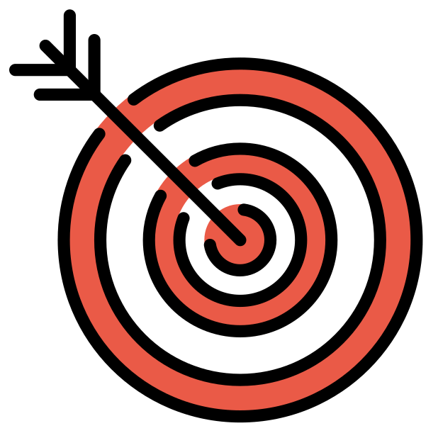

>**Wir möchten erreichen, dass Sie am Ende des Workshops ...**
>
>* ... einige Vorgehensweisen beschreiben können, die für die Organisation von Daten hilfreich sind.
>* ... beschreiben können, weshalb ein gutes Datenmanagement von Bedeutung ist.
>* ... einige relevante Strukturen und Services der CAU nennen können.
>* ... mit anderen und uns über ihre Vorgehensweisen im Umgang mit Daten und über Ihre Unterstützungsbedarfe diskutiert haben.
>* ... auch ein bisschen Spaß hatten.


## Limitationen🚧


>**Es gibt viel zu erzählen und zu diskutieren, dennoch:**
>
>* Aus zeitlichen Gründen werden wir heute nur auf wenige Aspekte dessen, was es über Datenmanagement zu wissen gibt, eingehen können.
>
>* Berufsspezifische Aspekte sind nicht speziell vorgesehen, dürfen von Ihnen aber sehr gerne in die Diskussionen eingebracht werden.
>
>* Bitte haben Sie Nachsicht! Wir sind noch am Beginn eines Angebotsaufbaus für technisch-administratives Personal. Um unser Angebot auf Ihre Bedürfnisse zuschneiden zu können, brauchen wir Ihren Input!
>
>* Zum Ende des Workshops nehmen wir daher gerne Ihre Wünsche für diesen und für weiterführende/vertiefende Workshopthemen auf.

## Agenda💪


>**Unsere Agenda für heute**
>
>- Ankommen: Workshop Regeln, Warm-up
>- Einstieg: Mit welchen Daten arbeiten Sie?
>- Datenmanagement? Was ist das und was soll das?
>- Forschungsdaten und Forschungsförderer
>- Daten ordnen und strukturieren
>- Services und Policies an der CAU
>- Diskussion und Ausklang

## Warm up🤹


> **Lassen Sie uns zum Aufwärmen ein kleines Spiel spielen:**
>
> Verdecken Sie Ihre Kamera mit einem Post-it oder einem Finger.
>
> Ich lese Aussagen vor.
>
> Bei jeder Aussage, der Sie zustimmen können, zeigen Sie sich bitte wieder und winken kurz in die Kamera.
>
> Los geht's!

{{1-2}}
********************************************************************************

><p style="color:#9a047f">Ich trinke morgens gerne Kaffee.</p>

********************************************************************************

{{2-3}}
********************************************************************************

><p style="color:#9a047f">Ich werden von Studierenden / Promovierenden bezüglich Vorgaben für Abschlussarbeiten u. ä. gefragt.</p>

********************************************************************************

{{3-4}}
********************************************************************************

><p style="color:#9a047f">Wenn ich mich entscheiden muss, ob ich ins Kino oder in ein Konzert gehe, entscheide ich mich wahrscheinlich für das Konzert.</p>

********************************************************************************

{{4-5}}
********************************************************************************

><p style="color:#9a047f">Ich arbeite in einem Labor.</p>

********************************************************************************

{{5-6}}
********************************************************************************

><p style="color:#9a047f">Ich arbeite in einem Sekretariat.</p>

********************************************************************************

{{6-7}}
********************************************************************************

><p style="color:#9a047f">Ich habe ein Haustier.</p>

********************************************************************************

{{7-8}}
********************************************************************************

><p style="color:#9a047f">Ich habe noch gar keine genaue Vorstellung davon, welche Inhalte zum Bereich Datenmanagement gehören könnten.</p>

********************************************************************************

{{8-9}}
********************************************************************************

><p style="color:#9a047f">Ich habe im Rahmen meiner Tätigkeiten mit Drittmittelanträgen zu tun.</p>

********************************************************************************

{{9-10}}
********************************************************************************

><p style="color:#9a047f">Ich wohne nicht in Kiel.</p>

********************************************************************************

{{10-11}}
********************************************************************************

><p style="color:#9a047f">Ich bin in einem Bereich der zentralen Verwaltung tätig.</p>

********************************************************************************

# Einstieg
>***Wir würden gerne erfahren, mit welchen Daten und mit welchen Tools Sie hauptsächlich arbeiten und mit welchen Anliegen Sie in diesen Workshop gekommen sind.***

> **Lassen Sie uns kurz gemeinsam sammeln:**
>
>* Daten und Tools, mit denen Sie beruflich umgehen.
>* Anliegen, die Sie in diesen Workshop mitbringen.
  
# Datenmanagement?


>**Was genau ist mit dem Begriff Datenmanagement gemeint? Welche Inhaltsaspekte gehören eigentlich dazu?**
>
> Was denken Sie? Welche Inhaltsaspekte gehören zum Datenmanagement?

## Begriffsdefinition Datenmanagement

{{0}}
********************************************************************************
>Datenmanagement beschäftigt sich mit Fragen zu den folgenden Themen:
>
> - Wie speichert man Daten?
> - Wo speichert man Daten?
> - Wie dokumentiert man Daten?
> - Wie organisiert man die Zusammenarbeit an Daten?
> - Wie bereitet man Daten auf?
> - Welche rechtlichen Aspekte sind ggf. zu beachten?
> - Welche ethischen Aspekte sind ggf. zu beachten?
>
>(https://www.forschungsdaten-bildung.de/daten-managen) 

********************************************************************************

{{1}}
********************************************************************************
>"Das Datenmanagement bezeichnet den gezielten Umgang mit Daten innerhalb einer Organisation oder Institution. Es umfasst die Planung, Organisation, Steuerung und Überwachung aller Prozesse, die für die Erfassung, Speicherung, Aufbereitung, Analyse und Nutzung von Daten erforderlich sind."
>
>(https://www.iph-hannover.de/de/dienstleistungen/data-science/datenmanagement/#:~:text=Das%20Datenmanagement%20bezeichnet%20den%20gezielten,Nutzung%20von%20Daten%20erforderlich%20sind.)

********************************************************************************

## Begriffsdefinition Forschungsdaten


>An Hochschulen und Forschungseinrichtungen müssen wir "besondere" Daten managen: **Forschungsdaten**.
>
><font size="5">**Was sind Forschungsdaten?**</font>

{{1-2}}
********************************************************************************
Die **DFG** definiert den Begriff **"Forschungsdaten"** folgendermaßen:

> „Zu Forschungsdaten zählen u. a. Messdaten, Laborwerte, audiovisuelle Informationen, Texte, Surveydaten oder Beobachtungsdaten, methodische Testverfahren sowie Fragebögen. Korpora und Simulationen können ebenfalls zentrale Ergebnisse wissenschaftlicher Forschung darstellen und werden daher ebenfalls unter den Begriff Forschungsdaten gefasst. Da Forschungsdaten in einigen Fachbereichen auf der Analyse von Objekten basieren (z. B. Gewebe-, Material-, Gesteins-, Wasser- und Bodenproben, Prüfkörper, Installationen, Artefakte und Kunstgegenstände), muss der Umgang mit diesen ebenso sorgfältig sein und eine fachlich adäquate Nachnutzungsmöglichkeit, wann immer sinnvoll und möglich, mitgedacht werden. Ähnliches gilt, wenn Software für die Entstehung oder Verarbeitung von Forschungsdaten erforderlich ist.“
>
> (*DFG 2021*)

********************************************************************************

{{2}}
********************************************************************************

Etwas weniger kompliziert definierte das PrePARe Projekt der Camebridge University den Begriff **Forschungsdaten** als:

> “Any any information you use in your research.”
>
> (*University of Camebridge PrePARe Project*)

********************************************************************************

### Beispiele für Forschungsdaten


- Audio- und Videoaufzeichnungen
- Tagebücher
- Daten aus geografischen Informationssystemen (GIS)
- Labor- und Feldnotizen
- Modell-, Skript- und Forschungssoftwarecode
- Bilder und Abbildungen
- Fragebögen und Codebücher
- Proben und Artefakte
- Sensor-Daten
- Sequenzierdaten
- Spektren
- Text- und Tabellenkalkulationsdokumente
- Textkorpora und Annotationen
- Topographie-Daten
- Abschriften

# Förderorganisationen

{{0-3}}
****************


>**Ein planvoller Umgang mit Forschungsdaten wird zunehmend von Förderorganisationen eingefordert.**
>
>- Angaben zum Forschungsdatenmanagement (FDM) sind heute in den meisten Förderanträgen verpflichtend.
>
>- Ein Datenmanagementplan ist in einigen Förderprogrammen (in unterschiedlichem Umfang und Detailgrad) im Antrag vorgesehen.
>
>- Datenmanagement ist ressourcenintensiv. Personal- und Sachkosten im FDM-Kontext sind z.T. förderfähig und sollten entsprechend eingeplant werden.

****************

{{1-3}}
****************

>**Informationen, die in Förderanträgen und/oder DMPs genannt werden sollten:**
>
>- Relevante FDM-Richtlinien (z. B. FAIR-Prinzipien, Forschungsdaten-Policy der Forschungsinstitution, Leitlinien der Fachgesellschaft)
>
>- Innerhalb des Vorhabens zu generierende und/oder nachzunutzende Daten bzw. Datentypen
>
>- Angaben zur geplanten Nutzung von IT-Infrastrukturen (u. a. zur Sicherung, Speicherung)
>
>- Angaben zur geplanten Veröffentlichung von Daten, z. B. in geeigneten Repositorien
>
>- Angaben zur Aufbewahrung von Daten nach Projektende

****************

{{2-3}}
****************

>
>
>- FDM-Vorgaben unterscheiden sich nicht nur hinsichtlich der jeweiligen Förderinstitution, sondern auch je nach Förderlinie bzw. Förderprogramm.
>
>- **Die Spezifika und Anforderungen des Förderprogramms sind daher vorab zu klären!**

****************

{{3}}
****************

>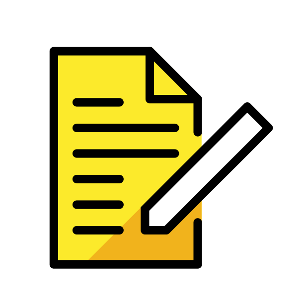
>
>- Unterstützung bei der Erstellung von DMPs bietet das Zentrale FDM der CAU: **info@fdm.uni-kiel.de**.
>
>- **Ein Template für einen DMP sowie weitere unterstützende Materialien finden Sie ebenfalls auf den Seiten des [Zentralen Forschungsdatenmanagements](https://www.datamanagement.uni-kiel.de/de/service/materialien)**

****************

# FAIR-Prinzipien

><font size="5">Das **Ziel** im Umgang mit Forschungsdaten ist es, Daten **langfristig** und **personenunabhängig** ~~zugänglich~~, ~~nachnutzbar~~ und ~~nachprüfbar~~ zu halten.</font>

{{0-1}}
********************************************************************************
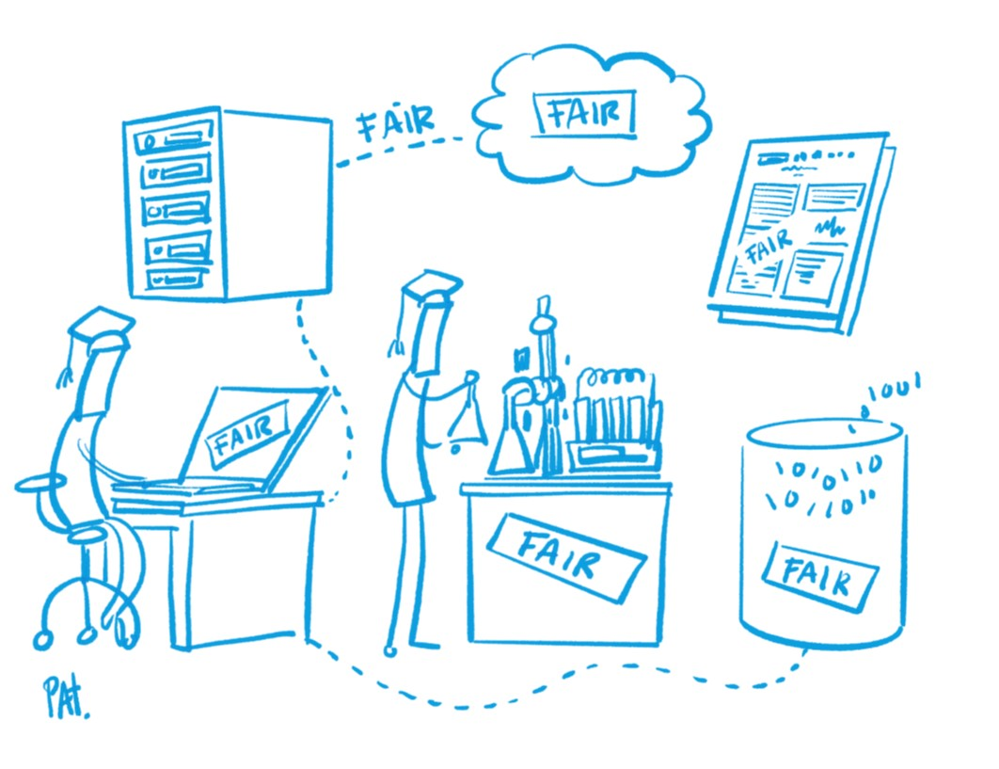

><font size="5">**Die [FAIR-Prinzipien](https://www.nature.com/articles/sdata201618) dienen in Bezug auf das Management von Forschungsdaten als Leitprinzipien!**</font>
<br>
<br>
<br>
<br>
<br>
<br>
<br>
<br>
<br>
<br>
<small>Illustration: Patrick Hochstenbach in [Engelhardt, Claudia et. al. (2021)](https://univerlag.uni-goettingen.de/bitstream/handle/3/isbn-978-3-86395-539-7/Engelhardt_FAIR.pdf?sequence=1&).</small>
********************************************************************************

{{1}}
>**F**indable

{{2-3}}
****************
Metadaten und Daten sollten sowohl für Menschen als auch für Computer leicht zu finden sein. Maschinenlesbare Metadaten sind für das automatische Auffinden von Datensätzen und Diensten unerlässlich und daher ein wesentlicher Bestandteil des FAIRification-Prozesses.

F1. (Meta)data are assigned a globally unique and persistent identifier

F2. Data are described with rich metadata (defined by R1 below)

F3. Metadata clearly and explicitly include the identifier of the data they describe

F4. (Meta)data are registered or indexed in a searchable resource

***************

{{1}}
>**A**ccessible

{{3-4}}
***********************
Es muss klar beschrieben sein, wie auf Daten zugegriffen werden kann, ggf. einschließlich Authentifizierung und Autorisierung.

A1. (Meta)data are retrievable by their identifier using a standardised communications protocol

A1.1 The protocol is open, free, and universally implementable

A1.2 The protocol allows for an authentication and authorisation procedure, where necessary

A2. Metadata are accessible, even when the data are no longer available

******************

{{1}}
>**I**nteroperable

{{4-5}}
**********************
Daten sollten in einer Form vorliegen, die die Nutzung mit diversen Anwendungen oder Arbeitsabläufen für Speicherung und Verarbeitung ermöglichen.

I1. (Meta)data use a formal, accessible, shared, and broadly applicable language for knowledge representation.

I2. (Meta)data use vocabularies that follow FAIR principles

I3. (Meta)data include qualified references to other (meta)data

**********************

{{1}}
>**R**eusable

{{5-6}}
***************
Das Ziel von FAIR ist es, die Wiederverwendung von Daten zu optimieren. Um dies zu erreichen, sollten Metadaten und Daten gut dokumentiert und beschrieben sowie mit einer eindeutigen Angabe bzgl. der Nutzungsbedingungen (z. B. Lizenzen) versehen sein.

R1. Meta(data) are richly described with a plurality of accurate and relevant attributes

R1.1. (Meta)data are released with a clear and accessible data usage license

R1.2. (Meta)data are associated with detailed provenance

R1.3. (Meta)data meet domain-relevant community standards

**************

<div style="page-break-after: always;"></div>

# Policies der CAU
In Bezug auf das Forschungsdatenmanagement relevante Policies der CAU:

- [Leitlinie zum Umgang mit Forschungsdaten](https://www.datamanagement.uni-kiel.de/de/forschungsdatenmanagement-an-der-cau/leitlinie-zum-umgang-mit-forschungsdaten)

- [Leitlinien zur Förderung von Open Access](https://www.datamanagement.uni-kiel.de/de/forschungsdatenmanagement-an-der-cau/leitlinien-zur-forderung-von-open-access)

- [Richtlinien der CAU zur Sicherung guter wissenschaftlicher Praxis](https://www.uni-kiel.de/fileadmin/user_upload/forschung/integritaet-ethik/downloads/Richtlinien-Sicherung-guter-wissenschaftlicher-Praxis.pdf)

# Daten ordnen und strukturieren

{{0-1}}
********************************************************************************
<div style="text-align:center">
><p style="color:#9a047f">**Es mag banal erscheinen, aber eine strukturierte Ordner- und Dateibenennung ist ein erster Schritt im Datenmanagement!**</p>
</div>

<center>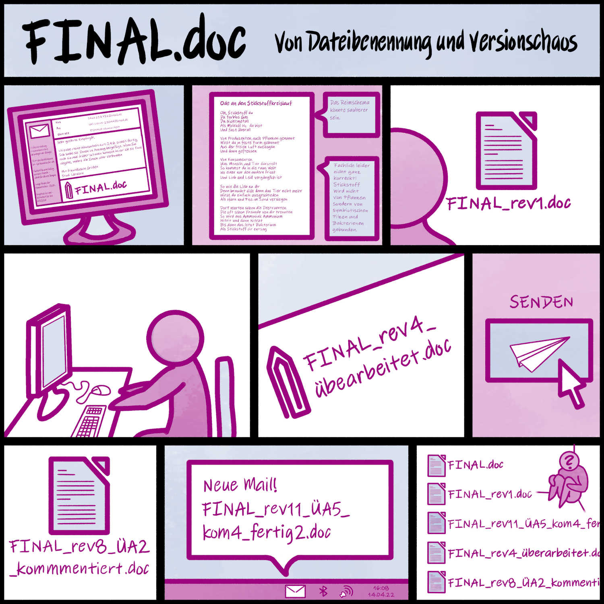</center>

<div style="text-align:center">
<P><SMALL>Illustration: Cleo Michelsen</SMALL></P>
</div>

********************************************************************************

{{1-2}}
********************************************************************************
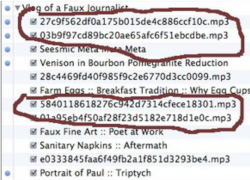

* Haben Sie sich schon mal über sich selbst geärgert, weil Sie bestimmte Dateien nicht oder nur mit großem Aufwand finden konnten?

* Sind Ihnen vielleicht sogar schon mal Daten verloren gegangen, weil Dateien versehentlich überschrieben wurden?

* Gibt es in Ihrem Arbeitsbereich Regeln bzgl. der Benennung von Ordnern und Dateien?

********************************************************************************

{{2}}
********************************************************************************


Ordner und Dateien sollten systematisch benannt und geordnet sein, damit

* die Dateien jetzt und in Zukunft leicht auffindbar und zugänglich sind,
* längeres Suchen von Dateien oder das Vergleichen verschiedener Versionen von Dateien vermieden wird,
* Änderungen nachvollziehbar sind,
* die Dateien nicht versehentlich gelöscht oder überschrieben werden,
* um die Zusammenarbeit zu verbessern und
* Automatisierungsprozesse zu ermöglichen.

********************************************************************************

## Ordnerstrukturen

Folgende Punkte können bei der Erstellung einer (nachvollziehbaren) Ordnerstruktur helfen:

{{1-9}}
********************************************************************************

* Ordner fassen Dateien mit gemeinsamen Eigenschaften zusammen

  * Mögliche Ordnungskategorien: Teilprojekte, Arbeitspakete, Datum oder Zeitraum (z. B. Monate, Quartale), Datentypen, Datenanalysen, Literatur, Formate, ...
{{2-9}}
* Beschreibende Ordnernamen verweisen auf die Inhalte
{{3-9}}
* Ordner sind hierarchisch strukturiert
{{4-9}}
* Es sind nicht mehr als drei Unterordner angelegt worden 
{{5-9}}
* Laufende und abgeschlossene Arbeiten werden getrennt
{{6-9}}
* Rohdaten werden gesondert abgelegt
{{7-9}}
* Es gibt eine Zwischenablage, die regelmäßig aufgeräumt wird -->
{{8-9}}
* Nicht mehr benötigte Dateien werden regelmäßig gelöscht

********************************************************************************

{{9-10}}
********************************************************************************

Es gilt außerdem:

* Ausprobieren und anpassen
* Dokumentieren/Dokumentation bei Änderungen anpassen
* Für gemeinsam genutzte Dateien gemeinsame Regeln festlegen
* Konsequent bleiben!

********************************************************************************

{{10}}
********************************************************************************
Beispiel Ordnerstruktur:

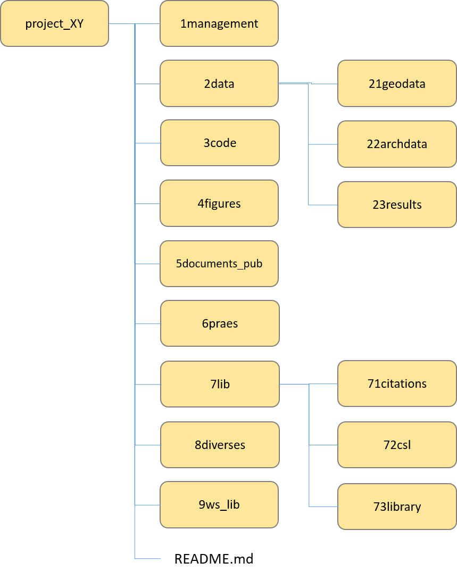<!-- width="350px" -->

********************************************************************************

## Dateibenennung

Die Art und Weise der Benennung von Dateien ist ein wichtiger Baustein im Datenmanagement.

Folgende Punkte können bei der Erstellung (nachvollziehbarer) Dateinamen helfen:

{{1-9}}
* Weniger als 32 Zeichen (besser noch weniger) für Dateinamen benutzen
{{2-9}}
* Dateinamen sollten möglichst deutlich auf den Inhalt der Datei hinweisen
{{3-9}}
* Grundsätzlich keine unspezifischen Dateinamen (z. B.untitled3746.csv) verwenden
{{4-9}}
* Keine Sonderzeichen, Umlaute oder Leerzeichen in Dateinamen benutzen
{{5-9}}
* Einzig erlaubte Sonderzeichen sind Unterstrich ( _ ) und Bindestrich ( - )
{{6-9}}
* Führende Null(en) bei Nummerierungen verwenden
{{7-9}}
* Datumsangaben nach der ISO 8601 (YYYYMMDD oder YYYY-MM-DD oder YYYY_MM_DD)
{{8-9}}
* Keine unspezifischen Namensanhänge, wie _final, _neu, _ fertig o. ä. verwenden!

{{9-10}}
********************************************************************************

**Es gilt außerdem:**

* Prüfen, ob bereits etablierte Dateibenennungskonventionen existieren
* Eigene Benennungsregeln in Form einer Dateibenennungskonvention festlegen und dokumentieren
* Dokumentation der Ordnerstrukturen und Benennungskonventionen inkl. genutzer Abkürzungen u. ä. in einer README-Datei
* Konventionen möglichst frühzeitig festlegen
* Unterschiedliche Konventionen für verschiedene Dateitypen sind erlaubt
* Dokumentieren/Dokumentation bei Änderungen anpassen

********************************************************************************

{{10}}
********************************************************************************
Beispiele für Benennungskonventionen:

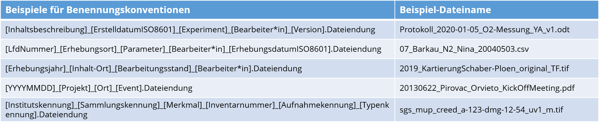

********************************************************************************

### Softwaregestützte Dateibenennung
Verschiedene Tools unterstützen das stapelweise Umbenennen von beliebig vielen Dateien und Ordnern in einem Durchgang:

**Windows:**

- Ant Renamer (https://www.antp.be/software/renamer)
- Bulk Rename Utility (https://www.bulkrenameutility.co.uk/)
- Total Commander (https://www.ghisler.com/deutsch.htm)

**Mac:**

- Renamer 6 (for Mac) (https://renamer.com/)
- Name Changer (https://mrrsoftware.com/namechanger/)
- ExifRenamer (https://www.qdev.de/?location=mac/exifrenamer)

**Linux:**

- GNOME Commander (https://gcmd.github.io/)
- GPRename (http://gprename.sourceforge.net/)

**Unix:**

- rename command 

## Versionierung

{{0-1}}
********************************************************************************

>* Um verschiedene Stadien der Bearbeitung von Dateien nachvollziehen und unterscheiden zu können, sollte eine konsequente Versionierung vorgenommen werden.
>
>* Das Vorgehen bei der Versionierung sollte allen, die gemeinsam an Datenmaterial arbeiten bekannt sein.
>
>* Versionierungen können im Dateinamen vorgenommen werden und die Vorgehensweise gemeinsam mit der Dokumentation zu Ordnerstruktur und Dateibenennung in der README-Datei dokumentiert werden.
>
>* In einer **Versionskontrolltabelle** kann eine Dokumentation der vorgenommenen Änderungen erfolgen.

********************************************************************************

{{1-2}}
********************************************************************************

**Versionierung im Dateinamen:**

Die Versionierung kann als Bestandteil des Dateinamens definiert werden und dabei zwischen größeren und kleineren Änderungen unterscheiden:

* Beispiel für größere Änderungen = Beispieldatei\_v1 -> Beispieldatei_v2
* Beispiel für kleinere Änderungen = Beispieldatei\_v1.1 -> Beispieldatei\_v1.2
* Beispiel für Major.Minor.Sub-Minor = Beispieldatei\_v0.1.0 -> Beispieldatei\_v0.1.1

><p style="color:#9a047f">**Unspezifische Bezeichnungen bitte vermeiden!**</p>
>
>* ~original1~
>* ~neu~
>* ~bearbeitung2~
>* ~final~
>* ~final_2~


********************************************************************************

{{2-3}}
********************************************************************************

**Beispiel für eine Versionskontrolltabelle**

| Versionsnr.  | Änderungen                       | Datum      | Bearbeitung durch |
| :----------  | :----------                      | ---        | ---               |
| 1.0          | Freigabe                         | 2023-11-2  | KL                |
| 1.1          | Verbesserung Rechtschreibfehler  | 2023-11-20 | KL                |
| 1.2          | Änderungen am Layout             | 2024-02-20 | GN                |
| 2.0          | Neues Kapitel (3.1.) hinzugefügt | 2024-02-26 | GN                |

Eine Versionskontrolltabelle kann innerhalb des bearbeiteten Dokuments oder als separate Datei angelegt werden.

********************************************************************************

### Softwaregestützte Versionierung

Es gibt eine Reihe von nützlichen Tools, die ggf. helfen, insbesondere textbasierte Daten und Forschungsdatencode zu verfolgen und zu versionieren.

Die am weitesten verbreiteten basieren auf dem Versionsverwaltungssystem Git und umfassen unter anderem:

* GitHub: https://github.com
* GitLab: https://about.gitlab.com

>Die CAU bietet einen GitLab Dienst: https://cau-git.rz.uni-kiel.de/users/sign_in 

## README

>Ordnerstrukturen und Namenskonventionen sollten in einer **README-Datei** dokumentiert werden, die als einfache Textdatei (z. B.: .md, .txt) auf der ersten hierarchischen Ebene der gewählten Ordnerstruktur abgelegt werden sollte.  
>
>Eine solche README-Datei könnte z.B. so aussehen:

<div style="float:left; width:85%;">

```markdown
# ALLGEMEINES
Projekt/Arbeitsbereich: [Bezeichnung des Projekts/Arbeitsbereiches]
Datum: [Datum der Erstellung]
Beschreibung: [Kurze Beschreibung des Projekts/Arbeitsbereiches]
Veranstwortliche: [Namen der Verantwortlichen]
Beteiligte: [Namen der Beteiligten]

Relevante zugehörige Links:
Link zu Univis: [Link]
Link zu OpenOlat: [Link]
Link zu CAUGitLab: [Link]
Link zum FIS: [Link]

# ORDNER
Alle Dateien, die sich auf das Projekt XY beziehen, werden im Ordner 
***[AnyProject]*** gespeichert.

Der Inhalt ist wie folgt in Unterordnern organisiert:

- **Management**: weitere Unterordner: Projektplanung, Finanzmonitoring, Berichte 
- **Meetings**: Präsentationen und Materialien der Projektmeetings, 
Unterordner ggf. nach Datum und Ort geordnet
- **Kommunikation**: Newsletter, Blogbeiträge, etc. 
Unterordner ggf. nach Datum geordnet
- **Rohdaten**: Alle Rohdaten werden in diesem Ordner abgelegt, 
weitere Unterordner sind ggf. nach Datum geordnet
- **AnalyseDaten**: Zu analysierende Datendateien, 
Unterordner ggf. nach Datum geordnet
- **Abbildungen**: Aus Analysedateien erstellte Abbildungen, 
Unterordner ggf. nach Datum geordnet
- **Referenzen**: Bibliothek mit Referenzen
- **AnalogeDokumentation**: Eingescannte Kopien schriftlicher Notizen/Belege
- **Verschiedenes**: Sonstige Informationen, die sich auf dieses Projekt beziehen

# DATEIBENENNUNG
## Management
Die Projektplanungsdokumente werden wie folgt benannt:

Projektkürzel_Planungsteil_Version.Dateiendung
(Beispiel: “AP001_Antrag_V1.docx”, AP001_Zeitplan_V1.docx)

Im Ordner Finanzmonitoring werden Dateien wie folgt benannt:

Projektkürzel_Kostenstelle_Jahr_Monat.Dateiendung
(Beispiel: “AP001_Personal_2023_Januar.docx”)

## Meetings
Die Dokumente zu den Meetings werden wie folgt benannt:

Datum_Ort_Beitrag_Version.Dateiendung
Beispiel: 2024-01-22_Köln_Poster_V1.2.pdf

## Rohdaten
Die Rohdaten-Dateien werden wie folgt benannt:

raw_YYYYMMDD_Gebiet_Object_Zustand.Dateiendung
(Beispiel: “raw_20230701_Bov_KS_2.csv”)

## Analysedaten
Die Dateien der Analysedaten werden wie folgt benannt:

„JJJJMMTT_Gebiet_Objekt_Kondition_Version“
(Beispiel: “20230701_Bov_KS_2_v1-0.csv”)

## Abkürzungen
Für Dateinamen werden folgende **Abkürzungen** verwendet:

*Projektkürzel*: AP001=AnyProject001
*Gebiet*: KI=Kiel, Bov=Bovenau, Emk=Emkendorf
*Objekte*: KS=Klingenschaber, S=Schraube
*Zustand*: 1=vollständig erhalten, 2=teilweise erhalten, 
3=schlecht erhalten/fragmentiert

# VERSIONEN
Versionsinformationen werden in Form einer Major-Minor-Angabe  
im Dateinamen angegeben(_vmajor-minor).

**große Änderungen**: Umfangreiche Korrekturen, Anpassungen oder Ergänzungen 
an einem Datensatz oder einer Textdatei, wie z.B. 
- eine große Anzahl zusätzlicher Einträge in einer Tabelle  
- umfangreiche Bereinigung von Daten 
- Hinzufügung eines Kapitels zu einem Text oder einer Präsentation. 

In diesem Fall erhöht sich die Versionsnummer in Schritten von eins 
(„Major“-Nummer + 1), z. B. von Version 2.0 auf Version 3.0. 
Wird die „Major“-Versionsnummer geändert, muss die „Minor"-Versionsnummer 
wieder von ‚0‘ an aufwärts nummeriert werden (z.B. Versionsänderung von 2.4 auf 3.0).

**kleinere Änderungen**: Die Versionsnummer an zweiter Stelle („minor“) 
erhöht sich um +1, wenn kleinere Korrekturen vorgenommen wurden, z. B. die Korrektur von Rechtschreib- und Tippfehlern in Texten oder Tabellen.

# SPEICHERUNG
Alle Dateien werden lokal auf der Festplatte des Computers gespeichert. 
Ein Backup in in die CAU Cloud und eine extere Festplatte erfolgt [täglich,wöchentlich,...].

# Letzte Änderungen
| Datum      | Änderung    | Bearbeitet durch |
| :--------- | :---------  | :---------       |
| Datum 1    | Dings 1     | XYZ              |

```
</div>

## ~~Gruppenarbeit~~: Austausch zu Ordnerstrukturen und Dateibenennung

>**Gruppenarbeit**
>
>Tauschen Sie sich zum aktuellen Vorgehen bzgl. Ordnerstrukturen und Dateibennungen in ihren jeweiligen Tätigkeitsbereichen aus.
>
>- Existieren bereits Konventionen für Ordnerstrukturen und Dateibenennungen?
>- Existieren Routinen, wie z. B. regelmäßiges Aufräumen/Sortieren oder Löschen?
>- Welche positiven Erfahrung können Sie teilen, wie Ordnung und Übersichtlichkeit von Dateien im Arbeisalltag aufrecht erhalten werden kann?
>- Welche negativen Erfahrung diesbezüglich können Sie teilen? 

# Formate

> **Warum ist es relevant, sich über genutzte Dateiformate Gedanken zu machen?**

## ~~Partnerarbeit~~: Dateiformate

> <!-- width="150px" align="right" -->
>
>**Partnerarbeit**
>
>Tauschen Sie sich zu den Dateiformaten aus, mit denen Sie arbeiten.
>
>* Mit welchen Dateiformaten arbeiten Sie?
>* Welche Software wird benötigt, um die Formate zu lesen und zu bearbeiten?
>* Welche Besonderheiten sind zu beachten?
>* Welchen Problemen sind Sie im Zusammenhang mit Dateiformaten schon begegnet?

## Empfehlungen: Dateiformate

Je nach konkretem Anwendungsfall ist individuell zu bewerten, für welchen Arbeitsschritt, welches Dateiformat zu nutzen ist. 

Sobald Daten geteilt werden und/oder archiviert werden sollen, ist auf möglichst große Interoperabilität der Formate zu achten. 

Die Tabelle bietet eine grobe Empfehlung:

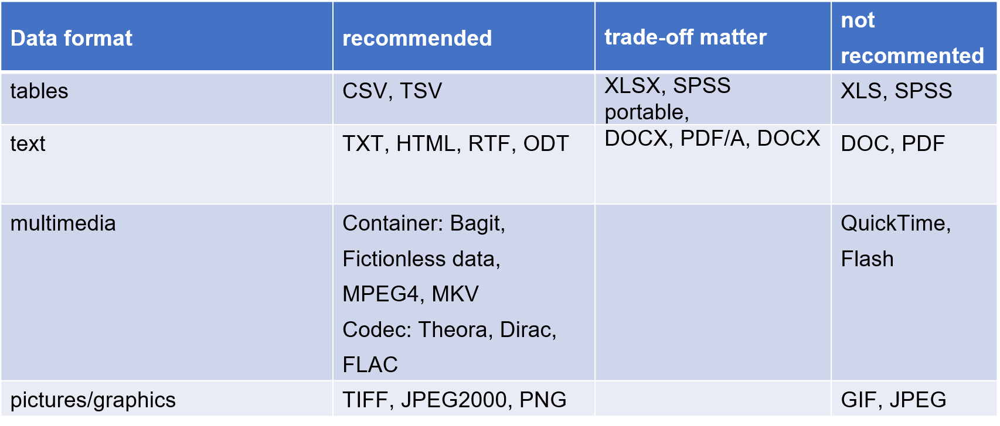 

**Weiterführende Informationen finden Sie z. B. hier:**

- https://forschungsdaten.info/themen/veroeffentlichen-und-archivieren/formate-erhalten/ 

- https://www.forschungsdaten-bildung.de/dateiformate 

- https://kost-ceco.ch/cms/kad_main_de.html

# FDM@CAU ✨
<div style="float:right; width:40%;">
  
</div>

Das **Zentrale Forschungsdatenmanagement** der CAU besteht aus Mitarbeitenden des Rechenzentrums, der Universitätsbibliothek und der Verwaltung.

Gemeinsam arbeiten, beraten und unterstützen wir zum Thema.

**Entwicklung eines campusweiten Forschungsdatenmanagements an der CAU**
2013	Zentrales FDM-Servicebüro und strategische Weiterentwicklung mit der AG FDM

2015	Verabschiedung einer universitären Leitlinie zum Umgang mit Forschungsdaten

2021	Zentrales FDM-Team 

**Zentrales Forschungsdatenmanagement heute**

- Derzeit 9 Kolleg*innen für FDM, DH, IT, Didaktik und Recht

- Kooperation zwischen RZ, UB, Verwaltung

- Entwicklung und Bereitstellung grundlegender Services für FAIR and Open Data

- Beratung und Schulungen für Forschende

- Praktische Unterstützung bei der Realisierung von FDM-Lösungen 

- Didaktische Beratung & Begleitung der Integration von FDM in die curriculare Lehre

- Einrichtung und Betrieb eines institutionelles Datenrepositoriums

Kontakte und Informationen zum FDM an der CAU finden Sie hier: https://www.fdm.uni-kiel.de/

## Datenschutz🦺

<iframe src="https://www.uni-kiel.de/gf-praesidium/de/recht/datenschutz-1" style="border:0px;width:100%;height:500px" allowfullscreen="true" webkitallowfullscreen="true" mozallowfullscreen="true"></iframe>

https://www.uni-kiel.de/gf-praesidium/de/recht/datenschutz-1

## Opendata@CAU 🔓

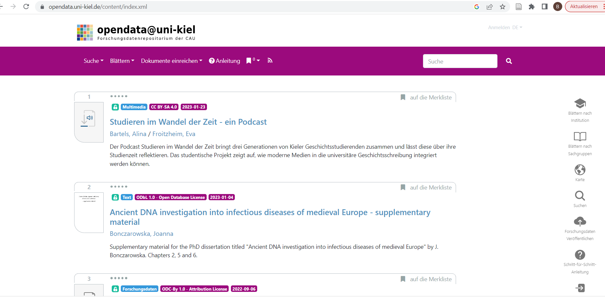

## MACAU 📝

<iframe src="https://macau.uni-kiel.de/content/index.xml" style="border:0px;width:100%;height:500px" allowfullscreen="true" webkitallowfullscreen="true" mozallowfullscreen="true"></iframe>

## IGSN Dienst 🍃

<iframe src="https://igsn.uni-kiel.de/de" style="border:0px;width:100%;height:500px" allowfullscreen="true" webkitallowfullscreen="true" mozallowfullscreen="true"></iframe>

## Literaturverwaltung 📚

{{0}}
***
Das Rechenzentrum stellt eine Citavi-Campuslizenz zur Verfügung:

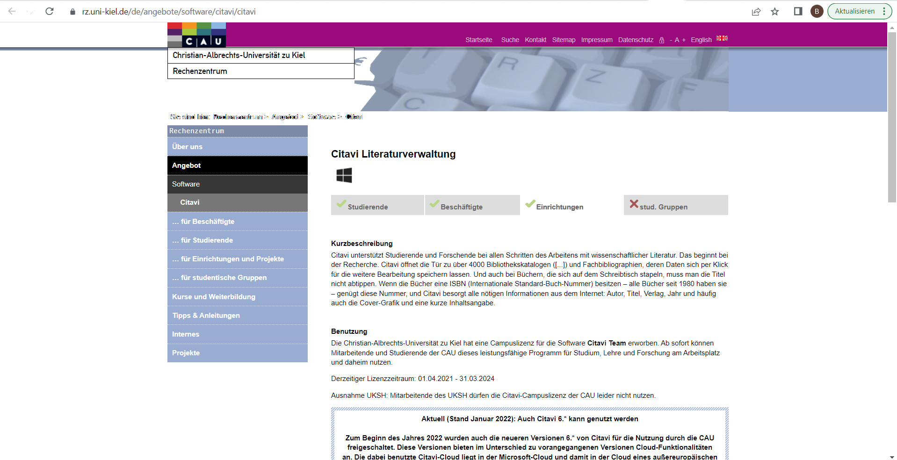

https://www.rz.uni-kiel.de/de/angebote/software/citavi/citavi

***

{{1}}
***
An der Universitätsbibliothek finden Sie Kurse zu citavi sowie verschiedenes Selbstlernmaterial:

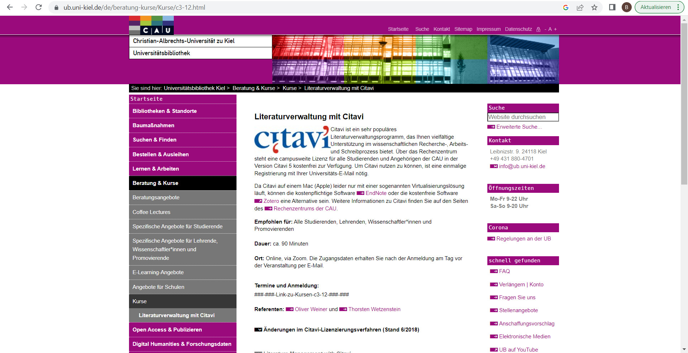

https://www.ub.uni-kiel.de/de/beratung-kurse/spezifische-angebote-fuer-lehrende-wissenschaftler-innen-und-promovierende

***

# Fragen und Anmerkungen

>Fast geschafft!
>
>Haben Sie noch Fragen oder Anmerkungen?

{{1}}
********************************************************************************

>Welche Workshopinhalte würden Sie sich für diese Veranstaltung oder für weitere separate Veranstaltungen zukünftig wünschen?
>
>Welche Workshopformate (online/präsenz) wünschen Sie sich?

********************************************************************************

# Feedback

> <!-- width="100px" align="right" -->
>
>Sie haben heute Abend noch eine Verabredung mit einigen Freunden. Ihre Freunde erinnern sich daran, dass Sie heute an einem Workshop zum Thema Datenmanagement teilgenommen haben und fragen: "Na, wie war's"?
>
>Was antworten Sie?

# Herzlichen Dank!
Das Team FDM der CAU finden Sie hier: https://www.fdm.uni-kiel.de/de


# Informationen zu diesem Dokument

| Parameter           | Info                       |
| --------            | :------                   |
| Titel:              | @title                     |
| Einsatz:            | @comment                   |
| Autor:innen         | @author                    |
| Lizenz              | @licence                   |
| Link zum Repository:| https://github.com/RDM4CAU |      